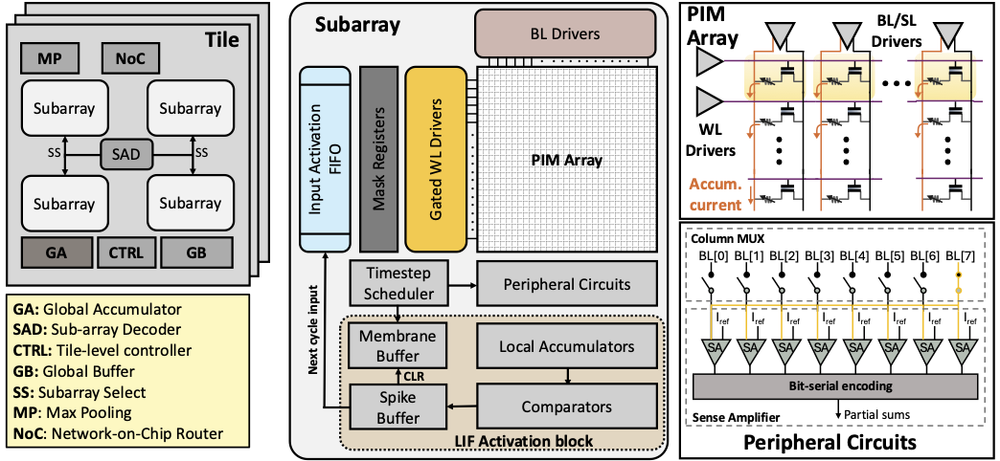
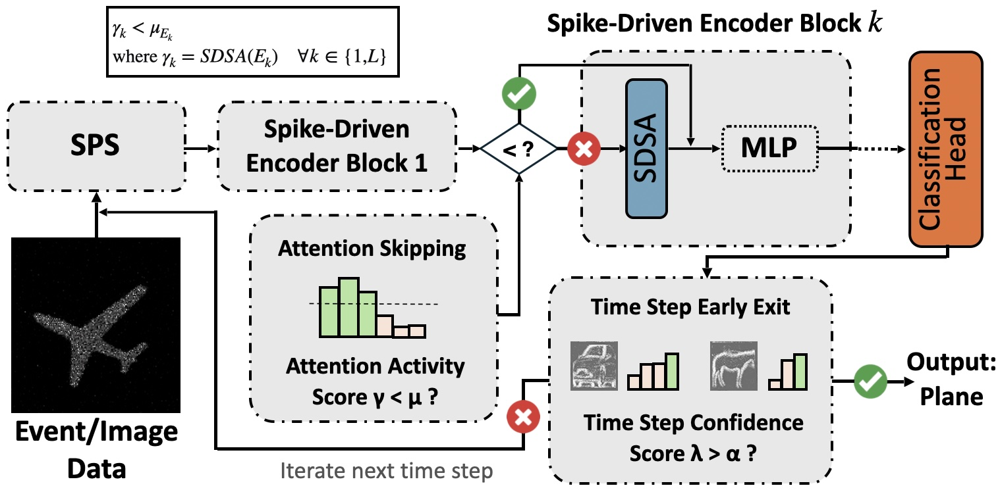
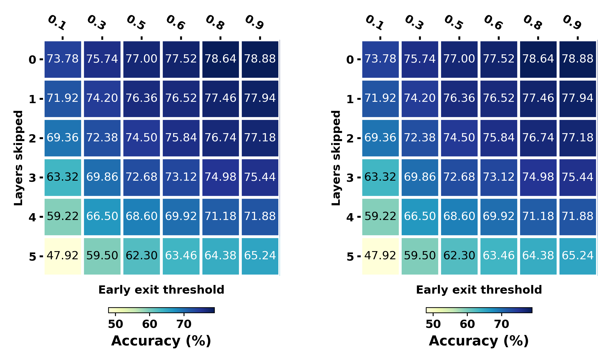

# ASTER: Attention-based Spiking Transformer Engine for Event-driven Reasoning

## Adapted from Spike-Driven-Transformer ([Github](https://github.com/BICLab/Spike-Driven-Transformer)) ([NeurIPS2023](https://openreview.net/forum?id=9FmolyOHi5)) and SEENN ([Github](https://github.com/Intelligent-Computing-Lab-Yale/SEENN)) ([NeurIPS2023](https://openreview.net/forum?id=mbaN0Y0QTw&noteId=1CTUDc0ucN))


## Abstract

The integration of spiking neural networks (SNNs) with transformer-
based architectures has opened new opportunities for ultra-low-
power, event-driven visual reasoning on edge devices. However, the
high temporal resolution and binary nature of spike-driven com-
putation introduce architectural mismatches with conventional
digital hardware. In this work, we propose a hardware accelera-
tor tailored for spiking transformers, optimized for deployment in
real-time event-driven frameworks such as visual reasoning with
event-based vision inputs. Our design leverages a hybrid analog-
digital Processing-in-Memory (PIM) architecture to realize compute
and memory-efficient end-to-end execution of spiking transformers.
A custom-designed dataflow is introduced, carefully co-optimized
with the spike-driven operational model to minimize memory ac-
cess overhead and maximize data reuse under spatiotemporal spar-
sity. The proposed architecture supports direct integration with
event-based encoders and produces outputs amenable to symbolic
reasoning modules, forming a complete neurosymbolic pipeline.
Evaluated on representative event-driven vision tasks, the accelera-
tor achieves up to 467x and 1.86× energy reduction compared to
edge GPU (Jetson Orin Nano) and previous PIM accelerators for
spiking transformers, while maintaining competitive task accuracy.
This work demonstrates the viability of spiking transformer accel-
eration for real-time, low-power visual reasoning at the extreme
edge.




## Requirements

```python3
# full requirement in environment.yml
timm == 0.6.12
1.10.0 <= pytorch < 2.0.0
cupy
spikingjelly == 0.0.0.0.12
tensorboard
```

> !!! Please install the spikingjelly and tensorboard correctly before raising issues about requirements. !!!

## Train & Test



The hyper-parameters are in `./conf/`.

Train for SDT:

```shell
CUDA_VISIBLE_DEVICES=0 python -m torch.distributed.launch --nproc_per_node=1 --master_port 29501 train.py -c /the/path/of/conf --model sdt --spike-mode lif

```

Test for SDT:

```shell
CUDA_VISIBLE_DEVICES=0 python -m torch.distributed.launch --nproc_per_node=1 --master_port 29501 firing_num.py -c /the/path/of/conf --model sdt --spike-mode lif --resume /the/path/of/parameters --no-resume-opt

```

Train and Test for ASTER Attention Skipping and Early Exit

```shell
# attention skipping
CUDA_VISIBLE_DEVICES=0 python -m torch.distributed.launch --nproc_per_node=1 --master_port 29502 main.py -c /the/path/of/conf --model sdt --spike-mode lif --auto-skip --log-file /the/path/of/sdt.log --skip-threshold 0.01

# early exit
CUDA_VISIBLE_DEVICES=0 python -m torch.distributed.launch --nproc_per_node=1 --master_port 29502 main.py -c /the/path/of/conf --model sdt --spike-mode lif --early-exit --exit-metric confidence --exit-threshold 0.9

# combine both
CUDA_VISIBLE_DEVICES=0 python -m torch.distributed.launch --nproc_per_node=1 --master_port 29502 main.py -c /the/path/of/conf --model sdt --spike-mode lif --auto-skip --log-file /the/path/of/sdt.log --skip-threshold 0.01 --early-exit --exit-metric confidence --exit-threshold 0.9

# add these arguments for test/validate only
--validate-only --initial-checkpoint /the/path/of/checkpoint
```


Fine-tune:
```shell
CUDA_VISIBLE_DEVICES=0 python -m torch.distributed.launch --nproc_per_node=1 --master_port 29502 finetune.py --finetune-checkpoint /the/path/of/checkpoint -c /the/path/of/conf --model sdt --spike-mode lif --no-resume-opt
```

Result and explainability (HeatMap of ASTER on ImageNet100):



## Data Prepare

- use `PyTorch` to load the CIFAR10 and CIFAR100 dataset.
- use `SpikingJelly` to prepare and load the Gesture and CIFAR10-DVS dataset.

Tree in `./data/`.

```shell
.
├── cifar-100-python
├── cifar-10-batches-py
├── cifar10-dvs
│   ├── download
│   ├── events_np
│   ├── extract
│   ├── frames_number_10_split_by_number
│   └── frames_number_16_split_by_number
├── cifar10-dvs-tet
│   ├── test
│   └── train
└── DVSGesturedataset
    ├── download
    ├── events_np
    │   ├── test
    │   └── train
    ├── extract
    │   └── DvsGesture
    ├── frames_number_10_split_by_number
    │   ├── download
    │   ├── test
    │   └── train
    └── frames_number_16_split_by_number
        ├── test
        └── train
```

ImageNet with the following folder structure, you can extract imagenet by this [script](https://gist.github.com/BIGBALLON/8a71d225eff18d88e469e6ea9b39cef4).

```shell
│imagenet/
├──train/
│  ├── n01440764
│  │   ├── n01440764_10026.JPEG
│  │   ├── n01440764_10027.JPEG
│  │   ├── ......
│  ├── ......
├──val/
│  ├── n01440764
│  │   ├── ILSVRC2012_val_00000293.JPEG
│  │   ├── ILSVRC2012_val_00002138.JPEG
│  │   ├── ......
│  ├── ......
```
